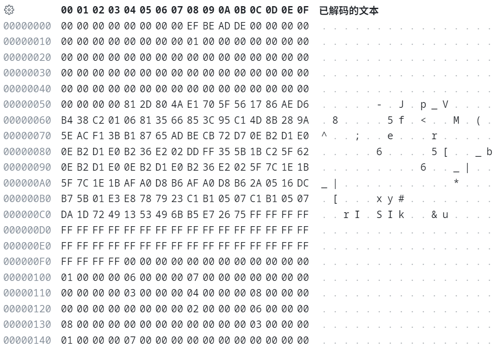

## Research Date
begin: 2024-12

## Research method
1. CE 

## Research materia
Tomb Raider GOTYE

## Research state
unfinished

## Symbols and address:
0x018B65C0-0x018B65CA: profile.dat

profile items
```
OptionsMenu_DefaultSettings
OptionsMenu_ApplyGraphics
MenuItem
IncreaseOption
DecreaseOption
SliderRail
GetSliderDesiredValue
SetSliderValue
CreateTabs
SetTabContent
SetCurrentTab
EnableOption
FillSpinnerOptionData
FillSliderOptionData
SetSelectedOption
SetSpinnerEntry
OptionsMenu_KeepSettings
SetLegendButtonEnabled
OptionsMenu_DiscardSettings
$OptionsMenu_GamePlay
$OptionsMenu_MouseKeyboard
$OptionsMenu_Gamepad
$OptionsMenu_InvertYAxis
$OptionsMenu_InvertXAxis
$OptionsMenu_InvertAimYAxis
$OptionsMenu_InvertAimXAxis
$OptionsMenu_MouseSensitivity
$OptionsMenu_MouseSmoothing
$OptionsMenu_AimSensitivity
$OptionsMenu_AimMode
$OptionsMenu_RunMode
$OptionsMenu_ShowButtonHints
$OptionsMenu_Vibration
$OptionsMenu_Difficulty
$OptionsMenu_TextLanguage
$OptionsMenu_VoiceLanguage
$OptionsMenu_Subtitles
$OptionsMenu_SFXVolume
$OptionsMenu_MusicVolume
$OptionsMenu_VCAlwaysSend
$OptionsMenu_VCVolume
OptionsMenu_GamepadLayout
SetLegendButtonVisible
SetPopupLegendSelection
$OptionsMenu_Hold
$OptionsMenu_Toggle
$MainMenu_DifficultyEasy
$MainMenu_DifficultyNormal
$MainMenu_DifficultyHard
$Language_English
$Language_French
$Language_German
$Language_Italian
$Language_Spanish
$Language_Japanese
$Language_Portuguese
$Language_Polish
$Language_Russian
$Language_Czech
$Language_Dutch
$Language_Arabic
$Language_Korean
$Language_Chinese
Menu_Off
Menu_On
ShowGamepadLayout
$OptionsMenu_UseLinkedAccounts
```

## disassemble

opcodes:

```
TombRaider.exe+6419B0 - 55                    - push ebp
TombRaider.exe+6419B1 - 8B EC                 - mov ebp,esp
TombRaider.exe+6419B3 - 8B 4D 08              - mov ecx,[ebp+08]
TombRaider.exe+6419B6 - 85 C9                 - test ecx,ecx
TombRaider.exe+6419B8 - 75 09                 - jne TombRaider.exe+6419C3
TombRaider.exe+6419BA - B8 E8658B01           - mov eax,TombRaider.exe+9965E8 { ("Profile and settings") }
TombRaider.exe+6419BF - 5D                    - pop ebp
TombRaider.exe+6419C0 - C2 0400               - ret 0004 { 4 }
TombRaider.exe+6419C3 - 81 F9 C9000000        - cmp ecx,000000C9 { 201 }
TombRaider.exe+6419C9 - 75 09                 - jne TombRaider.exe+6419D4
TombRaider.exe+6419CB - B8 00668B01           - mov eax,TombRaider.exe+996600 { ("Tomb Raider Last Campsite") }
TombRaider.exe+6419D0 - 5D                    - pop ebp
TombRaider.exe+6419D1 - C2 0400               - ret 0004 { 4 }
TombRaider.exe+6419D4 - 8D 41 FF              - lea eax,[ecx-01]
TombRaider.exe+6419D7 - 83 F8 62              - cmp eax,62 { 98 }
TombRaider.exe+6419DA - 77 1C                 - ja TombRaider.exe+6419F8
TombRaider.exe+6419DC - 51                    - push ecx
TombRaider.exe+6419DD - 68 1C668B01           - push TombRaider.exe+99661C { ("Tomb Raider GameSave%d") }
TombRaider.exe+6419E2 - 68 20D9FE02           - push TombRaider.exe+20CD920 { (0) }
TombRaider.exe+6419E7 - E8 E4EDA1FF           - call TombRaider.exe+607D0
TombRaider.exe+6419EC - 83 C4 0C              - add esp,0C { 12 }
TombRaider.exe+6419EF - B8 20D9FE02           - mov eax,TombRaider.exe+20CD920 { (0) }
TombRaider.exe+6419F4 - 5D                    - pop ebp
TombRaider.exe+6419F5 - C2 0400               - ret 0004 { 4 }
TombRaider.exe+6419F8 - 33 C0                 - xor eax,eax
TombRaider.exe+6419FA - 5D                    - pop ebp
TombRaider.exe+6419FB - C2 0400               - ret 0004 { 4 }
```

```
file["Profile and Settings"] = profile.dat // Key: Address:0x018B65E8
file["Tomb Raider Last Campsite"] = lastcamp.dat
file["Tomb Raider GameSave%d"] = save%d.dat
```

## game profile file format
magic: 0x789C

compress method: zlib

data structure: unknown yet. (possible C++ struct)

## inflated data sample


